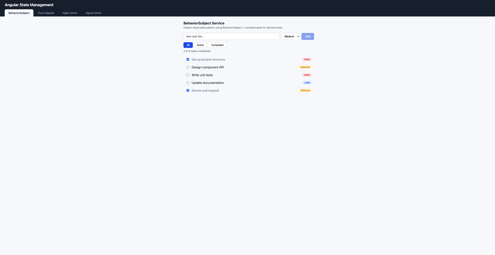

# Angular State Management Bootcamp

A hands-on Angular 19 demo that implements the **same task manager feature four times** — once with each major state management approach — so you can compare them side-by-side.



---

## Why Do We Need State Management?

As Angular applications grow, **state** — the data your UI depends on — becomes harder to manage:

- **Shared state across components**: Multiple components need the same data (e.g. a user profile shown in the header, sidebar, and settings page). Without a central source of truth, you end up passing data through deeply nested `@Input()` chains (prop drilling) or duplicating data in multiple places.
- **State synchronization**: When one component updates data, every other component displaying that data must reflect the change immediately. Manual event wiring between siblings and distant components becomes fragile.
- **Async complexity**: Real apps fetch data from APIs, handle loading and error states, cache responses, and retry failures. Scattering this logic across components leads to duplicated code and inconsistent UX.
- **Predictability and debugging**: As the number of state mutations grows, it becomes difficult to answer _"how did the app get into this state?"_. Structured state management gives you a single place to look.
- **Testability**: Business logic embedded in components is harder to test. Extracting state into services or stores makes unit testing straightforward.

### Do We Really Need Complex State Management for Every Application?

**No.** Choosing the right level of state management is just as important as choosing the right tool.

| Application Type                                                                              | Recommended Approach                                | Why                                                                                                    |
| --------------------------------------------------------------------------------------------- | --------------------------------------------------- | ------------------------------------------------------------------------------------------------------ |
| **Small apps / prototypes**                                                                   | Component-local state or simple services            | Minimal overhead; easy to understand                                                                   |
| **Medium apps** with shared state across a few features                                       | **BehaviorSubject services** or **Angular Signals** | Lightweight, no extra dependencies, enough structure to stay organized                                 |
| **Large enterprise apps** with many teams, complex async flows, and strict auditability needs | **NgRx Store** (full Redux)                         | Enforced unidirectional data flow, action logging, time-travel debugging, clear separation of concerns |
| **Medium-to-large apps** that want store-like structure without Redux boilerplate             | **NgRx SignalStore**                                | Modern, tree-shakable, signal-native, far less code than classic NgRx                                  |

> **Rule of thumb**: Start simple. If your state logic becomes hard to follow or you find yourself wiring up complex inter-component communication, _then_ adopt a more structured solution. Don't reach for NgRx Store in a 3-page CRUD app.

---

## Angular's Direction: From NgRx Store Toward SignalStore

Angular's roadmap is moving toward **signals as the primary reactivity primitive**, replacing Zone.js and reducing reliance on RxJS for state management. The NgRx team has followed this direction:

```
Angular 16          Angular 17-18              Angular 19+
───────────         ──────────────             ───────────
Signals introduced  Signals stabilized         Signals are the default
Zone.js required    Zone.js optional           Zoneless apps supported
                    @ngrx/signals released     SignalStore is production-ready
                                               NgRx Store still supported but
                                               SignalStore is the recommended
                                               path for new projects
```

**Why the shift?**

- Signals provide **fine-grained reactivity** without Zone.js overhead
- SignalStore is **fully tree-shakable** — you only ship the features you use
- SignalStore collapses the action/reducer/effect/selector ceremony into a single declarative store definition
- The Angular team and the NgRx team are collaborating to make signals the foundation of Angular's reactive model

---

## NgRx Store Architecture (Redux Pattern)

```
┌─────────────────────────────────────────────────────────┐
│                      COMPONENT                          │
│                                                         │
│   Dispatches actions           Reads state via          │
│   store.dispatch(action)       store.select(selector)   │
└──────────┬─────────────────────────────▲────────────────┘
           │                             │
           ▼                             │
┌─────────────────────┐                  │
│      ACTIONS        │                  │
│                     │                  │
│  { type, payload }  │                  │
└──────────┬──────────┘                  │
           │                             │
     ┌─────┴─────┐                       │
     ▼           ▼                       │
┌─────────┐ ┌──────────┐         ┌──────┴───────┐
│ REDUCER │ │ EFFECTS  │         │  SELECTORS   │
│         │ │          │         │              │
│ Pure fn │ │ Side     │         │ Derived      │
│ returns │ │ effects  │         │ state via    │
│ new     │ │ (API     │         │ createSelect │
│ state   │ │ calls)   │         │ or()         │
└────┬────┘ └────┬─────┘         └──────▲───────┘
     │           │                      │
     ▼           │                      │
┌─────────────── ▼ ─────────────────────┘─────────┐
│                    STORE                         │
│                                                  │
│   Single immutable state tree                    │
│   { tasks: [...], filter: 'all', loading: false }│
└──────────────────────────────────────────────────┘

Flow:  Component ──dispatch──▶ Action ──▶ Reducer ──▶ Store ──▶ Selector ──▶ Component
                                           ▲
                               Action ──▶ Effect ──▶ API ──▶ Action (success/failure)
```

**Files required for one feature:**

```
task.actions.ts    →  Define action types + payloads
task.feature.ts    →  Reducer + initial state (createFeature)
task.effects.ts    →  Side effects (API calls)
task.selectors.ts  →  Derived state queries
```

---

## NgRx SignalStore Architecture

```
┌─────────────────────────────────────────────────────────┐
│                      COMPONENT                          │
│                                                         │
│   Calls methods             Reads signals               │
│   store.addTask(...)        store.filteredTasks()        │
│   store.loadTasks()         store.loading()              │
└──────────┬─────────────────────────────▲────────────────┘
           │                             │
           ▼                             │
┌──────────────────────────────────────────────────────────┐
│                    SIGNAL STORE                          │
│  signalStore(                                           │
│    ┌─────────────────────────────────────────────┐      │
│    │  withState({ tasks, filter, loading })      │      │
│    │  ── Reactive signal-based state             │      │
│    └─────────────────────────────────────────────┘      │
│    ┌─────────────────────────────────────────────┐      │
│    │  withComputed({ filteredTasks })             │      │
│    │  ── Derived state (replaces selectors)       │      │
│    └─────────────────────────────────────────────┘      │
│    ┌─────────────────────────────────────────────┐      │
│    │  withMethods({ addTask, toggleTask, ... })   │      │
│    │  ── State mutations (replaces actions +      │      │
│    │     reducer cases)                           │      │
│    └─────────────────────────────────────────────┘      │
│    ┌─────────────────────────────────────────────┐      │
│    │  rxMethod (loadTasks)                        │      │
│    │  ── Async operations (replaces effects)      │      │
│    └─────────────────────────────────────────────┘      │
│  )                                                      │
└──────────────────────────────────────────────────────────┘

Flow:  Component ──method call──▶ patchState() ──▶ Signals update ──▶ Component re-reads
                                                                      (automatic via signals)
```

**Files required for one feature:**

```
task-signal.store.ts  →  Everything in one file
```

---

## NgRx Store vs SignalStore: Full Comparison

| Aspect                 | NgRx Store                                                    | NgRx SignalStore                            |
| ---------------------- | ------------------------------------------------------------- | ------------------------------------------- |
| **Pattern**            | Redux (action → reducer → store → selector)                   | Reactive store (state + computed + methods) |
| **Boilerplate**        | High — actions, reducer, effects, selectors in separate files | Low — single `signalStore()` definition     |
| **Files per feature**  | 4-5 files                                                     | 1 file                                      |
| **Reactivity model**   | RxJS Observables + `async` pipe                               | Angular Signals (synchronous reads)         |
| **Side effects**       | `createEffect` in a separate class                            | `rxMethod` inline within store              |
| **Derived state**      | `createSelector` (memoized)                                   | `withComputed` + `computed()`               |
| **State mutations**    | Dispatch action → reducer handles it                          | Call method → `patchState()` directly       |
| **DevTools**           | Full Redux DevTools support (time-travel, action log)         | Limited DevTools support (improving)        |
| **Tree-shaking**       | Partial — store infrastructure always included                | Full — only ship the features you use       |
| **Bundle size**        | Larger (`@ngrx/store` + `@ngrx/effects`)                      | Smaller (`@ngrx/signals` only)              |
| **Learning curve**     | Steep — many concepts to learn                                | Gentle — feels like writing a service       |
| **Best for**           | Large teams, complex async, audit trails                      | Most new Angular projects                   |
| **Zone.js dependency** | Works with Zone.js change detection                           | Designed for zoneless Angular               |

---

## Tree-Shaking: Why It Matters

**Tree-shaking** is the process where the build tool (Angular CLI + esbuild/webpack) removes unused code from the final bundle. Only code that is actually imported and referenced gets shipped to the browser.

### How Each Approach Fares

| Approach             | Tree-Shakable?      | Details                                                                                                                                                                                            |
| -------------------- | ------------------- | -------------------------------------------------------------------------------------------------------------------------------------------------------------------------------------------------- |
| **BehaviorSubject**  | N/A                 | No library overhead — just RxJS operators you already use                                                                                                                                          |
| **Pure Signals**     | N/A                 | Built into `@angular/core` — zero additional bundle cost                                                                                                                                           |
| **NgRx Store**       | Partial             | `@ngrx/store` core (~12 KB min+gz) is always included once you register a store. `@ngrx/effects` adds more. Even if you only use one feature, the store infrastructure ships.                      |
| **NgRx SignalStore** | Fully tree-shakable | Each `with*` function (`withState`, `withComputed`, `withMethods`) is independently tree-shakable. If you don't use `rxMethod`, it doesn't ship. If you don't use `withComputed`, it doesn't ship. |

### What Makes SignalStore Tree-Shakable?

NgRx SignalStore is built with **functional composition** rather than class inheritance:

```typescript
// Each "with*" is a standalone function — unused ones are removed by the bundler
signalStore(
  withState(...)       // only included if used
  withComputed(...)    // only included if used
  withMethods(...)     // only included if used
  // rxMethod         // NOT included if you don't import it
)
```

NgRx Store, by contrast, uses a **class-based architecture** with a central `Store` service, `ActionsSubject`, `ReducerManager`, and `EffectsModule` — all of which must be present at runtime regardless of how many features you register.

> **Bottom line**: For bundle-sensitive applications (mobile, slow networks, PWAs), SignalStore delivers a measurably smaller footprint.

---

## What We Built

A tabbed single-page app where every tab delivers an identical task manager UI:

- Display tasks with title, completion status, and priority (low / medium / high)
- Add tasks via an inline form (title + priority)
- Toggle tasks between complete and incomplete
- Filter tasks by All, Active, or Completed
- Show a derived counter: _"X of Y tasks completed"_
- Simulate async API loading with a 500 ms delay

The only thing that changes between tabs is **how state is managed**.

## The Four Approaches

| Route              | Approach                    | Key Concepts                                                                                               |
| ------------------ | --------------------------- | ---------------------------------------------------------------------------------------------------------- |
| `/behaviorsubject` | **BehaviorSubject Service** | `BehaviorSubject`, `combineLatest`, `async` pipe — the classic RxJS pattern                                |
| `/pure-signals`    | **Pure Angular Signals**    | `signal()`, `computed()`, `update()` — zero extra packages                                                 |
| `/ngrx-store`      | **NgRx Store**              | `createFeature`, `createReducer`, `createEffect`, `createActionGroup`, selectors — full Redux pattern      |
| `/signal-store`    | **NgRx SignalStore**        | `signalStore`, `withState`, `withComputed`, `withMethods`, `rxMethod` — reactive store without boilerplate |

## Project Structure

```
state-mgt-demo/
├── src/app/
│   ├── shared/
│   │   ├── task.model.ts            # Task interface & TaskFilter type
│   │   ├── task-api.service.ts      # Fake API returning mock data with delay(500)
│   │   └── task-list.component.ts   # Presentational component (shared across all tabs)
│   │
│   ├── behaviorsubject/
│   │   ├── task-bs.service.ts       # State managed with BehaviorSubject streams
│   │   └── behaviorsubject.component.ts
│   │
│   ├── pure-signals/
│   │   ├── task-signal.service.ts   # State managed with Angular signals + computed
│   │   └── pure-signals.component.ts
│   │
│   ├── ngrx-store/
│   │   ├── task.actions.ts          # Action group (createActionGroup)
│   │   ├── task.feature.ts          # Feature state + reducer (createFeature)
│   │   ├── task.effects.ts          # Side effects for async loading
│   │   ├── task.selectors.ts        # Derived state (createSelector)
│   │   └── ngrx-store.component.ts
│   │
│   ├── signal-store/
│   │   ├── task-signal.store.ts     # SignalStore (withState, withComputed, withMethods, rxMethod)
│   │   └── signal-store.component.ts
│   │
│   ├── app.routes.ts                # 4 routes + redirect
│   ├── app.config.ts                # Providers (router, NgRx store, effects)
│   └── app.component.ts             # Tab bar shell
```

## How Each Approach Works

### BehaviorSubject Service

- Uses `BehaviorSubject` for each piece of state (`tasks`, `filter`, `loading`)
- Derives filtered tasks with `combineLatest` + `map`
- Mutates state via `.next()` and `.getValue()`
- Components subscribe with the `async` pipe

### Pure Angular Signals

- Uses `signal()` for each piece of state
- Derives filtered tasks with `computed()`
- Mutates state via `.set()` and `.update()`
- No extra dependencies — built into Angular 19

### NgRx Store (Redux Pattern)

- Actions defined with `createActionGroup`
- Reducer built with `createFeature` + `createReducer` + `on()`
- Async loading handled by `createEffect` in a separate `TaskEffects` class
- Derived state via `createSelector`
- Components dispatch actions and select state from the global store

### NgRx SignalStore

- Single `signalStore()` call replaces actions, reducer, effects, and selectors
- `withState` defines initial state
- `withComputed` replaces selectors
- `withMethods` replaces actions + reducer cases
- `rxMethod` bridges RxJS for async operations (replaces effects)

## Tech Stack

- **Angular** 19.2 (standalone components, new `@if` / `@for` control flow)
- **NgRx Store** 19.2 (`@ngrx/store`, `@ngrx/effects`)
- **NgRx SignalStore** 19.2 (`@ngrx/signals`)
- **RxJS** 7.8
- **TypeScript** 5.7

## Getting Started

```bash
cd state-mgt-demo
npm install
ng serve
```

Open [http://localhost:4200](http://localhost:4200) — the app defaults to the BehaviorSubject tab. Click through the tabs to compare each approach.
